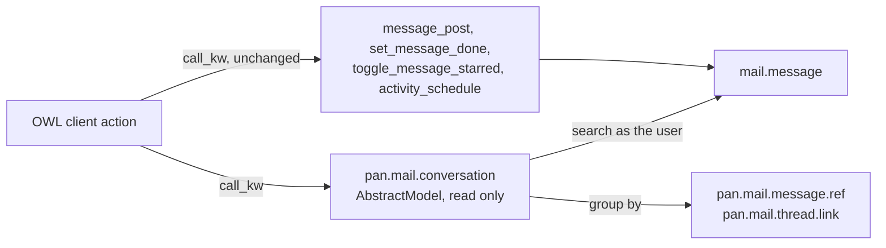
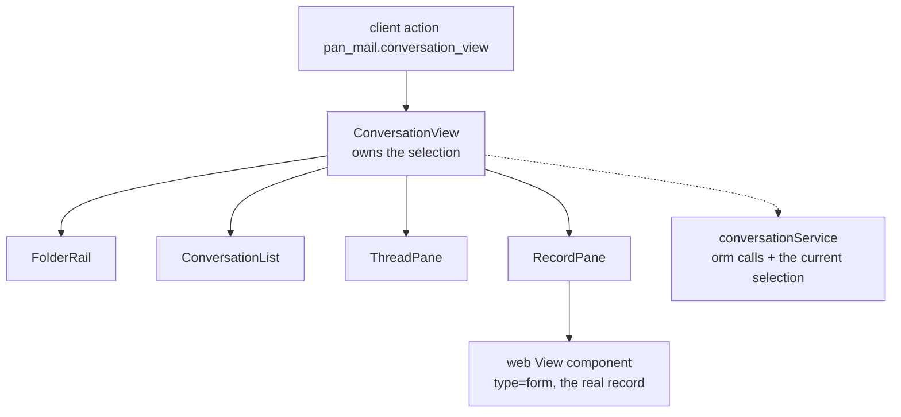

# Building the conversation view

Status: **steps 1 to 4 built**, 19.0.10.0.0 and 19.0.11.0.0; steps 5 and 6
proposed. The screen and its rules are in
[conversation-view.md](conversation-view.md); this file is how it gets built.
What shipped is the read layer, the client action with its four panes, Reply
and Log note through Odoo's own composer, the tab strip, and the record pane
without its chatter. What is still on paper inside step 4 is the composer's own
To/Cc/followers block: the reply uses Odoo's composer unextended, which fills
To from the newest inbound message and leaves Cc alone. What the browser found
that no unit test would have is at the bottom, under **What actually broke**.

## The decision: OWL, inside the Odoo backend

Not a separate frontend. The one thing this product has that Outlook cannot
have is the fourth pane, the real Odoo record -- its fields, its status bar and
its buttons, rendered by Odoo -- and there is exactly one place where that is
free: inside the web client, where the form view already exists and already
knows the session.

What a standalone app (React, its own service) would cost:

| | Inside the backend | A separate app |
|---|---|---|
| The fourth pane | Odoo's own form view, mounted | Rebuilt, per model, forever |
| Access rights | The ORM applies them | Reimplemented, and wrong once is a leak |
| Session, login, 2FA | Already there | A second auth surface |
| Deployment | An addon | A second thing to host, upgrade and secure |
| Chatter, activities, followers | The components exist | Rebuilt |

The freedom is not worth what it costs here, and the cost is paid in the one
place we cannot afford it: a mail screen that shows a message to somebody who
may not read it. So OWL it is, in `web.assets_backend`, as a client action.

The single point where that could go wrong is named at the bottom, under
**Risks**.

## Backend

### No table, one namespace

The view stores nothing, so it adds no table. It does add one
`AbstractModel`, `pan.mail.conversation`, as a place for the read methods to
live. An AbstractModel is a namespace, not storage; it still gets documented in
ARCHITECTURE.md because CI checks that every model in `models/` is named there.



**Reads go through the new namespace. Writes do not.** Every action the screen
offers is an existing Odoo method called on the record itself. We do not wrap
them: a wrapper is a second implementation of a decision Odoo already made, and
the reply path in particular (followers, notifications, the routing log) has to
behave exactly as the chatter does.

### The five read methods

That is the whole API. Each returns plain dicts, and each is paginated.

| Method | Takes | Returns |
|---|---|---|
| `folder_counts` | `mailbox_id` | one row per folder with its count |
| `search_conversations` | `mailbox_id`, `folder`, `partner_id`, `search`, `limit`, `offset` | list rows: `model`, `res_id`, `message_id`, `subject`, `preview`, `correspondent`, `partner_id`, `date`, `count`, `record_name`, `unread`, `waiting_on_us`, `mailbox` |
| `read_conversation` | `model`, `res_id`, `mailbox_id`, `message_id`, `limit`, `offset`, `scope` | the messages (`scope` picks Mail or Everything), the record chips, the files, the open activities, and for an unfiled one what the matcher rejected |
| `customer_timeline` | `partner_id`, `kinds`, `limit`, `offset` | the merged axis: messages, done activities, record events |
| `record_conversations` | `model`, `res_id` | what door 1 needs: how many conversations touch this record, and how many of their messages sit elsewhere |

### Start from the messages, never from the index

The order of the query is the security model.

```python
# right: the ORM applies the rules, then the index widens the names
messages = self.env['mail.message'].search(domain)     # ACL applied here
links = self.env['pan.mail.thread.link'].sudo().search(...)  # after, never before
records = self.env[model].browse(ids)._filtered_access('read')

# wrong: the index is not access controlled, so a thread key read first
# betrays the existence of a record the user cannot open
links = self.env['pan.mail.thread.link'].search([...])
messages = ...
```

The `sudo()` on the index buys the lookup and not the answer: the ACL on
`pan.mail.thread.link` is mailbox-manager only, and every record it yields goes
back through `_filtered_access`. A message on a record the user cannot open is
not in the result, the conversation shows a smaller count, and that is the
correct answer rather than a hidden one.

### The list query

The list needs the newest message per thread, which is one `read_group` and one
follow-up read:

1. `read_group` on `mail.message`, grouped by the thread key, aggregating
   `max(date)` and `count`, ordered by the max, with `limit` and `offset`.
2. `browse` the ids of those newest messages for the preview line.
3. Unread from `mail.notification` for the current partner, in one search
   over the same message ids.

**Waiting on us** is computed in step 2 from rows already in memory: the newest
message's `x_direction` is `incoming`. Never stored, never cached, never stale.
The two folders that depend on it are settled after the grouping query rather
than inside it, because direction lives on a message and the question is about
the newest one.

**Folder counts** are `_read_group` with a limit of 100 and a "99+" label. An
exact count means aggregating every row the reader can see, once per folder, on
every click; nobody reads the exact number of conversations in a busy mailbox.

### What must be covered by tests

`tests/test_conversation_api.py`, unit, no services:

- Every method returns the documented shape, and returns it empty rather than
  raising on an empty mailbox.
- A message on a record the user cannot read is absent from
  `search_conversations`, `read_conversation` and `customer_timeline`, for a
  user who is a mailbox reader. This is the test the layer exists to pass.
- Waiting-on-us flips when a reply is posted, in the same transaction.
- `customer_timeline` merges the three kinds in date order and honours `kinds`.

## Frontend

### One client action, five components



- **A client action**, registered in `registry.category("actions")`, so it gets
  the breadcrumb, the app switcher and a URL like every other Odoo screen. Not a
  new view type: this is one screen, not a way of rendering any model.
- **`ConversationView`** holds the selection (mailbox, folder, thread, message)
  in a `useState`, and nothing else holds state.
- **`RecordPane`** mounts Odoo's own `View` component with `type="form"`, which
  is what `FormViewDialog` already does with a form inside another component.
  **Without the chatter**: pane 3 is the chatter now, and two composers a
  divider apart is the thing that decision fixes. See
  [Writing happens in one pane](conversation-view.md#writing-happens-in-one-pane).
- **`ThreadPane`** owns the tab strip -- Mail, Everything, Files, Activities --
  and the composer under it. Three of the four read from
  `pan.mail.conversation`; Activities reads `mail.activity` on the records the
  conversation touched, because those rows are Odoo's and stay Odoo's.
- **`conversationService`** is the only thing that calls `orm`. Components read
  from it and call it; they never call `orm` directly, which is what keeps the
  five methods above the whole API surface.

### Door 1 lives in a patch

The "Open in mail" button and the "3 more messages elsewhere" line are a patch
on Odoo's Chatter component, fed by `record_conversations`.

**Patch the prototype, never the `components` dict.** 19.0.7.7.1 cost a release
to this: `patch(WebClient, {components: ...})` works on community and white
screens Enterprise, because `WebClientEnterprise` spreads the parent's
`components` in its class body before the patch lands. Bind the class to an
instance attribute in a patched `setup()` and use `t-component`, the way
`static/src/js/connect_banner.js` already does, and keep the static check that
fails a component tag in a borrowed template.

### No realtime in v1

Odoo's bus could push new mail into the open screen. It also brings Discuss's
machinery, a second source of truth about what is unread, and a class of bug
that only shows up under load. v1 refreshes on window focus and after every
action. If somebody asks for live updates, that is a decision with a bus
channel behind it, not a detail.

### Loading, empty and error states, on purpose

- **Loading:** the panes keep their layout and show skeleton rows. A screen
  that collapses to a spinner and back is how a fast app feels slow.
- **Empty:** an unfiled conversation gets the designed state from the plan, not
  an empty panel. An empty folder says which folder and offers the one next
  action.
- **Error:** an RPC failure leaves the previous content and shows one line with
  a retry. It never clears the pane the user was reading.

### What must be covered by tests

- A tour (`HttpCase`) that opens the action, selects a conversation, and asserts
  the record pane rendered the form. That is the load-bearing assumption.
- A step and a screenshot in `tools/ui_check.py`, as CLAUDE.md requires for any
  new screen, at 1440 and 2000 px.
- The Enterprise-shape static check, extended to the new templates.

## Order of work

Each step ends somewhere demoable, which is the only way this gets built in a
company with no headcount to spare.

1. `pan.mail.conversation` with `search_conversations` and `read_conversation`,
   plus their tests. No UI. The API is inspectable from a shell.
2. The client action with the folder rail, the list and the thread. No record
   pane. Already useful: it is the first time a mailbox is readable in Odoo.
3. The record pane. The risky step, alone, so it cannot take anything else down
   with it.
4. The tab strip and the composer, and the chatter off the record pane. These
   are one step, not two: taking the chatter away before its replacement ships
   leaves no way to write a note, and shipping the replacement while the
   chatter is still there is the second composer all over again.
5. Door 1, the chatter patch.
6. The customer view and its timeline, which is `customer_timeline` plus a tab.

### Turning the chatter off: candidate 2 landed

`View` takes `display: { controlPanel: false }`, which is how the pane already
drops the breadcrumb; there is no documented `chatter: false` beside it. Two
candidates were named, and the second is what shipped: `display: none
!important` scoped to `.o_mailpro_record`, on `.o-mail-Form-chatter`,
`.o-mail-Chatter` and the pre-17 container name. `display: none` takes the
composer out of the tab order as well as off the screen, so what it costs is
one wasted mount and one message fetch per selection, not a control somebody
can reach by accident.

The first candidate -- a `useSubEnv` flag a patched `FormRenderer` reads -- is
still the better one and is still unwritten. It needs the installed Odoo
source in front of you: the renderer's chatter branch is not documented, and
guessing it is how you get a white screen with an empty server log.

`tools/ci_ui.sh` carries the assertion either way: nothing matching a chatter
is visible inside the record pane.

## What actually broke

Four things, none of which a unit test could have seen. They are here because
the next person to mount an Odoo view inside their own component will hit the
same ones.

- **Bootstrap's display utilities carry `!important`.** Odoo's form renderer
  wears `d-flex flex-nowrap` in its wide layout, so a plain
  `display: block` on it loses, the sheet keeps a width of zero, and the pane
  shows a chatter with no record above it. It renders, it just renders nothing
  you wanted.
- **The mailbox picker opened on the notification mailbox**, which is the one
  address in the database nobody reads. First run of the screen: an empty
  inbox, on a database with mail in it.
- **19.0 refuses `default_res_id` by name.** The composer takes
  `default_res_ids`, a list, because it also composes in batch. The error is a
  raised `ValueError` in an "Oops" dialog, not a console warning.
- **The thread read newest-first**, because that is how the query is ordered
  and nobody had looked at it. A conversation reads downwards.

## Risks

- **Mounting the form view inside our own component.** Everything rests on it.
  De-risk it in step 3 on its own, and read what `FormViewDialog` does in the
  installed source rather than trusting this paragraph.
- **The list query on a large mailbox.** A `read_group` over `mail.message` on
  a database with millions of rows is the thing to measure before step 2 is
  called done. Measure on a restored customer backup, the way the migration
  rehearsal already does.
- **Import paths.** Everything named here as `@web/...` or `@mail/...` must be
  checked against the Odoo version in the container before it is typed. They
  move between versions, and a wrong one fails silently in the browser with an
  empty server log.
