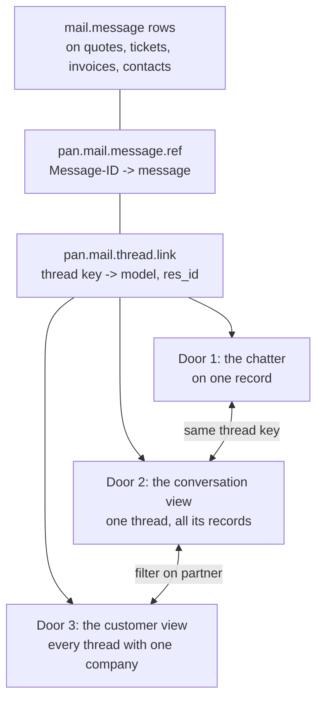

# The conversation view

Status: **mostly built**, 19.0.13.1.0. The inbox itself ships: the mailbox list,
the conversation list with its filters and search, New Email, the thread with
its four-position tab strip, linking in two steps with the suggestion chips,
and the record pane without its chatter, reading through
`pan.mail.conversation`, which is in `ARCHITECTURE.md` because it exists now.
Door 1's button ships in 19.0.15.3.0: **Open in mail** in every chatter on a
record that carries mail, opening the Inbox on that conversation or, when the
record carries more than one thread, on its list. Still on paper: door 1's
more-messages-elsewhere line, and the customer view with its timeline, whose
read method (`customer_timeline`) shipped and is tested, so what is left of it
is markup. Drafts ship in 19.0.17.0.0: a third
folder in the mailbox list, a **Save draft** beside Send, and the unsent answer
on the conversation it belongs to. *All mailboxes*, the one folder that spans
them, ships in 19.0.18.3.0: the row, the mailbox on every list row that needs
one, and the reply that answers from the conversation's mailbox rather than the
folder's. Also still on paper: the composer's
**Cc/followers block**. Reply opens Odoo's own composer with To filled from
the newest inbound message and Cc not filled at all. New Email opens the same
composer in a dialog after the record is picked, rather than in pane 3 as
decided below. What the MVP needs of this file is in [mvp.md](mvp.md).

Canvas: https://claude.ai/artifact/KsLjy3wNcx7q3dX34Gh3hB -- six artboards:
the inbox, an unfiled conversation, the model, the chatter with its door to the
mail, one customer's correspondence across records, and that customer's
timeline with the open activities on top.

The survey says two thirds of respondents already send from inside Odoo and
that what they cannot do is see a customer's correspondence in one place.
Odoo's chatter is record-centric; mail is conversation-centric. This is the
smallest object that closes that gap, in the layout people already know.

How it gets built -- the read API, the OWL components, and why this is not a
separate frontend -- is in
[conversation-view-build.md](conversation-view-build.md).

## The decision

**The conversation is a new object, and it is read in an inbox.**

A conversation groups `mail.message` rows that already exist. It does not copy
them, so every message keeps the access rights of the record it sits on and the
queue removed in 19.0.7.0.0 does not come back in another shape. Threading is
the `References` chain, with the provider's thread id as the fallback the
matcher already uses.

The screen is four panes:

1. **Folders.** The mailbox you are in and its folders -- Inbox and Sent, the
   two words every mail client uses -- and nothing else. Shared mailboxes below
   your own. The states that are ours are not folders and are not here: naming
   them as places mail sits makes the mailbox list read as a filter panel next to the
   mail client the same person has open. 19.0.11.1.0.
2. **The conversation list.** Sender, subject, snippet, date, and the record the
   thread is filed on. Unread is weight, not a badge, and it is the only state
   on a row: a mailbox has read and unread, and a state of ours ("needs reply")
   is a second inbox to keep correct. Over it, a header with the folder's name
   and nothing else. The filters -- unread, and the two unfiled ones (on a
   contact only, linked to nothing) -- live in the search bar at the top,
   behind the arrow on its end, where Odoo's control panel keeps both ways of
   narrowing a list. Each one is named in the bar as a facet, so a short list
   is never short for a reason nobody can see, and removed where it is named.
   A filter is a question about the folder you are in, so it survives a folder
   switch. 19.0.13.0.0 built that bar; 19.0.15.1.0 merged the two controls
   into one; 19.0.18.0.0 replaced the imitation with Odoo's own `SearchBar`
   over a search view on `mail.message`, which is where the filters now live
   -- and with it came autocomplete per field, several filters at once, a date
   filter and a custom one.
3. **The thread.** Messages in order, quoted history collapsed, and a reply that
   goes out through the right mailbox with the conversation quoted underneath.
   That last part is a survey complaint in its own right: today each chatter
   reply reaches the customer as a standalone mail. This is also the only pane
   you write in; see [Writing happens in one pane](#writing-happens-in-one-pane).
4. **The record.** The quote, ticket or invoice the thread is filed on. Its
   fields, its status bar and its buttons -- not its chatter, which pane 3 now
   is. This is the pane a mail client cannot have, and the reason to read
   mail here rather than in Outlook. It is not, however, a pane nobody else
   has: see [the competition](../research/competition.md), where a paid module
   already advertises chatter sync with document links and a free one ships the
   same three-pane shape. What is ours is the discipline below, and the
   transport underneath.

Above the panes, the bar every mail client has, in the order they all put it:
**New Email** on the left, the **search** in the middle. Typing is the search,
debounced; Escape gives the folder back. New Email opens the same two-step
dialog linking opens -- which kind of record, then which record -- and only
then opens the composer, in the conversation pane like a reply. The record is
not optional: a mail this module sends with nothing behind it is the "linked
to nothing" state the filter menu one pane over exists to find. 19.0.13.0.0;
the composer moved from its own window into the pane in 19.0.13.2.0.

The panes are the reader's, not ours. Every divider drags, the mailbox list and
the record pane fold away, and the widths live in the browser, so the screen
opens tomorrow the way it closed tonight. The list and the thread do not fold:
a screen with no mail on it is not this screen. 19.0.10.2.0.

Inside the mailbox list, each mailbox folds away too, the way an account does in
Outlook: the caret opens and closes it, the name opens the mailbox itself, and
which ones stand open is remembered next to the widths. A folded mailbox is not
counted, so the mailbox list costs one folder query per mailbox somebody actually
watches rather than one per mailbox that exists. 19.0.10.4.0.

### Reading every mailbox at once

**Decision: one row at the top of the mailbox list, *All mailboxes*, with the
same Inbox and Sent under it. Not a drop-down, and not a tick-list of
mailboxes.** 19.0.18.3.0.

Apple Mail puts All Inboxes behind a chevron because its sidebar keeps the
accounts folded away underneath it. Ours already draws every mailbox in the
same pane, so a chevron that expands to those same rows is a second copy of the
pane one row above it.

The read side already does this. `_base_domain(mailbox_id=None)` is every
message the reader may see, `folder_counts` already keys that as mailbox `0`,
and `mailboxKey()` already returns `0` for "no mailbox", which is the key the
folds and the counts are stored under. Today that state means "no mailbox is
configured yet"; with mailboxes it means all of them. The unified inbox is a
row and a label over a query that exists, not a new read path.

**Which mailbox a mail is in is drawn in two places, and only where it can be
more than one:**

1. **In the list row**, in the meta line, left of the record chip: the mailbox's
   local part -- `sales`, `info`, `support` -- with the full address as its
   title. Drawn only while the list spans more than one mailbox. Repeating one
   address down thirty rows of a single-mailbox folder is noise, so this is a
   property of the list and not of the row.
2. **In the conversation head**, always: the address the mail arrived on, after
   the correspondent, on the line that already reads *correspondent, n
   messages*. In a single mailbox it is the answer to "am I looking at the
   right account"; in the unified list it is the answer to "who is about to
   reply".

**No colour per mailbox.** A colour is a legend the reader has to learn and
hold, it runs out at the seventh mailbox, and it says nothing to a screen
reader or in a screenshot pasted into a ticket. The local part is shorter than
a dot and already carries the meaning.

**Sent shows the same chip**, where it reads as the from address. That is what
somebody scanning their own sent mail across three mailboxes is looking for.

**The part that is not visual, and is where the bug would be.** The composer
defaults `x_send_from_mailbox_id` to `state.mailboxId`
(`conversation_view.js:1066`, `:1127`). In the unified view that is null, so a
reply falls back to `_resolve_route()` and can answer from an address the
customer never wrote to. Reading across mailboxes must not change which address
answers: the reply sends from the mailbox of the **conversation** being read,
not of the folder being shown. So `_conversation_row` carries `mailbox_id`
beside the address it already carries, and the composer reads the row rather
than the state. A test asserts it, because this one is silent.

**Search widens with the folder.** The empty state says *"The search covers
this mailbox. Try another one, or clear it."* Under All mailboxes it covers all
of them, so it reads *"The search covers every mailbox you can read. Clear it
to see the folder again."* instead.

**Where it opens.** A reader with more than one mailbox lands in All mailboxes;
with one, in that one. Stored next to the pane widths and the folds, like every
other thing this screen remembers.

**Dropped: picking a subset.** Apple's per-account tick-list, and any
mailbox multi-select. All or one. Somebody who wants two of six has the search
box, which under All mailboxes now spans everything they can read.

When nothing is linked, the fourth pane shows what the matcher considered and
rejected, with a one-click way to file it. An unfiled conversation is the case
that decides whether people trust the screen, so it gets a designed state rather
than an empty panel.

### Writing happens in one pane

**The record pane shows the record, never its chatter. Pane 3 is the only
place on this screen where you write anything.**

Until 19.0.10 the fourth pane mounted the whole form, chatter included, so the
screen offered two composers a divider apart. They are not the same composer:
pane 3's reply threads under the message it answers and addresses the people
who were on it, the chatter's does neither. That is the exact record-centric
limitation this screen exists to fix, so the chatter is what loses.

What the chatter carried still has to live somewhere. It is four things, and
they split two and two.

**A tab strip above the thread, four positions, one control.**

| Tab | What it shows |
|---|---|
| **Mail** | `message_type = 'email'`. The correspondence, nothing else. The default |
| **Mail + notes** | The same thread with internal notes and record events interleaved by date |
| **Files (n)** | Every attachment on the conversation's messages, newest first |
| **Activities (n)** | `mail.activity` on the records this conversation touched, with Schedule |

Mail and Mail + notes are two readings of one list; Files and Activities are two
other lists. One strip rather than a toggle plus a tab bar, because two pieces
of chrome over one pane is chrome competing with content. The count is only
drawn when it is not zero.

The tab is the reader's, stored in the browser next to the pane widths, and it
is per person rather than per conversation.

**One writing action per tab, on the tab that shows what it writes.** Reply
lives in Mail, Log note in Mail + notes, and Files and Activities carry neither,
because a list is not a place to write. Both buttons on every tab is what made
a note written in Mail vanish the moment it saved, and the screen answered by
switching tabs under the reader. Switching tabs itself re-reads in place: Mail
and Mail + notes are one conversation read two ways, so the pane is never
emptied and the messages somebody had open stay open.

**In Mail + notes**: notes are drawn apart from correspondence -- indented,
marked internal, no recipient line. Record events (tracking values and the
rest of `message_type = 'notification'`) are one line each, never a card: *Stage:
New -> Qualified, Jan, Tuesday*. **A note is never quoted in a reply**, which
is the one part of this that is a test rather than a convention, because it is
the failure a customer sees.

This reverses what this document said before, and the reversal has a reason.
The earlier decision was "notes are interleaved always, and there is no
toggle", which was right while the chatter stayed in pane 4 as the complete
history. Once pane 3 is the only surface it has to carry both readings:
somebody clearing forty mails should not read forty stage changes on the way,
and somebody catching up on one deal wants all of it. A mode is the cheap way
to serve both; two built screens would not have been.

**Record buttons stay on the record.** Confirm, Create Invoice, Convert to
Opportunity: those are pane 4's remaining job and they belong next to the
fields they change. One primary action per screen still holds -- pane 3's Send
is the primary one, and 19.0.10.0.0 already demoted the statusbar's button row
for saying otherwise.

### To, Cc, Bcc, and the followers

The composer is Odoo's own `mail.compose.message`, extended. A composer of our
own would be a second implementation of templates, attachments, the Send From
dropdown and `message_post`, drifting from the day it shipped.

It has the two modes the chatter has, and **the visible difference between
them is the recipient block appearing and disappearing.** That is the whole
teaching: one of these reaches the customer, the other does not.

**Send.**

- **To** -- the author of the newest inbound message in this conversation.
  Editable.
- **Cc** -- that message's other recipients, minus our own mailbox address.
  Editable. It travels as `mail.mail.email_cc`, which all three provider
  clients already put on the wire. This is the survey complaint *"geen cc
  zichtbaarheid bij ontvanger, veroorzaakt veel verwarring"* answered directly:
  the customer can see who else is on the thread because those people are
  addressees, not followers.
- **Followers** -- a separate line underneath, never merged into To or Cc:
  *Also notified in Odoo: Jan, Piet (+2)*. Read-only here; followers are
  managed on the record, in pane 4, where the list belongs.

**Followers on the screen.** Pane 4 lost its chatter in 19.0.10.0.0, and the
follower list went with it; nothing on the Inbox showed who Odoo notifies about
this record. Built in 19.0.13.7.0: a **Followers** button at the right end of the
tab strip, beside Activities, opening Odoo's own follower list (the same
dropdown the chatter's people icon opens, with its add, remove and
subtype edits). Not a fifth tab: the four tabs are readings of the
conversation, and a tab whose whole content is three names is an empty screen
with a list in the corner. Not in pane 4 either: the record form has no
chatter to hang it on, and a follower list drawn by hand there is the second
implementation this document keeps refusing.

**Log note.** No To, no Cc, no followers line. The note reaches the record's
followers through Odoo's own note subtype, exactly as the chatter does. A
recipient row on a note is what makes people believe a note is an email.

**Nobody is subscribed by this screen.** `message_post` is called without
`mail_post_autofollow`, and a Cc'd address goes out as an address rather than
as a `partner_ids` entry. That is the other survey complaint -- *"the automatic
adding of followers creates complications"* -- and it is the position this
document already took, now with a field to hang it on.

**Bcc is the case we drop.** It is not built and it is not coming back as a
composer field. `mail.mail` has no Bcc, `normalize_headers()` refuses one off
the wire, and two tests in `test_provider_contract.py` pin both absences on
purpose (19.0.6.3.0). A field that exists leaks eventually -- through an
export, the API, a report or a template -- and no respondent asked for one.
Somebody who needs a blind copy has a mail client. If Bcc ever arrives it
arrives as a design change with a reason, not as a third input on a form.

### A new mail

**Every mail sent from this screen is posted on a record, and the default is
the contact. There is no unlinked outbound mail.**

That is the one decision here. 19.0.12.0.0 established why: a `mail.message`
with no `model` is visible to its author and to almost nobody else, so a new
mail with no record is a mail the colleague who has to answer the reply cannot
see. `res.partner` is the real fallback state, the "On a contact only" folder
is where it lands, and the reader can move it from there like any other
mail.

**New** sits at the top of the conversation list and is that pane's one
primary action. It opens in pane 3, because that is the only pane anybody
writes in, and the list keeps its selection so the thread being read is still
there after a discard.

The composer is the same `mail.compose.message`, in the same inline form, with
the reply's block plus two lines:

- **From** -- the mailbox. The Send From dropdown the composer already has.
- **To**, **Cc** -- empty instead of filled from an inbound message. No Bcc,
  for the reasons above.
- **Subject** -- required. A reply inherits one; a new mail without one is the
  mail nobody answers, and it is also what the `References` root will carry.
- **Linked to** -- directly above Send, always drawn, and it starts empty.
  The first To's contact is the first chip, **offered and not chosen**; beside
  it that contact's own open documents, the quote, the ticket, the invoice.
  Send stays off until one is picked. A typed address that matches no contact
  becomes one, the way Odoo's composer already makes one, so there is always
  at least that chip to pick. *Other...* opens the picker `link_targets()`
  already serves, which is the same list triage corrects a match from.

  **The pick is deliberate, not a default.** Putting somebody's
  correspondence on a record is a change to that record, and a prefilled
  value under the fold is the filing nobody read and triage has to undo
  later. One click, on a word the writer looked at. It is also the cheapest
  place this product ever gets to teach what it does: the mail you are
  sending lands here.
- **Followers** -- the read-only line, drawn only once the link is a real
  document. Same rule as the reply, and nobody is subscribed by this screen
  here either.

With a conversation selected, New starts from it: To is its correspondent and
the record it is on is the first chip offered. Still picked by hand, for the
reason above. That is the "mail this customer about this quote" case, and it
costs nothing because both values are already on screen.

Send is `message_post` on the linked record, so the reply arrives through the
matcher, finds the `References` root in the thread index, and lands on the same
record at rule 3. The link is written once, by the person who knew it, and the
conversation compounds from there.

**The cases we drop.**

- ~~**Drafts.**~~ Shipped in 19.0.17.0.0, and the refusal above is the reason
  the shape is as small as it is. One table, `pan.mail.draft`, private to its
  author, on the record the mail will be sent from -- so sending it changes
  nothing about where the conversation lives. No drafts of internal notes.

  **Saved on leaving, not on a timer.** A draft is written by **Save draft**,
  and by walking away from a composer somebody typed in: clicking another
  conversation, or the step back on a phone. Not every few seconds -- an
  autosave on a timer writes a row for every Reply anybody ever opened, which
  is the second inbox this section refused, and it does it at the rate a
  person types. Leaving writes one row, once. **Discard still discards**: the
  one case where losing the answer is what was asked for.
- **More than one record.** One mail, one record. `mail.message` has one
  `res_id`, and a mail that is about two things is two mails or a link in the
  body.
- **Creating a record from the composer.** No "new lead from this mail". Make
  the record, then write from it. A composer that also creates documents is a
  second creation form, with none of the validation of the first.

### Many conversations on one record

**A record holds many conversations, and that is the ordinary case.**
`pan.mail.thread.link` maps a thread key to one record, so the record side was
always the many side. A quote picks up a question in March and a delivery
complaint in June; those are two conversations on one `sale.order`, and the
only thing that would be wrong is treating them as one.

Nothing is stored differently for it and nothing merges. Three of the four
surfaces need no rule at all:

- **The conversation list** draws two rows carrying the same record chip. That
  is what happened, so it is what it shows.
- **The record pane** is one record either way.
- **The chatter** already interleaves every message filed on the record, which
  is Odoo's behaviour and stays it.

The one place it needs a decision is **door 1's button**. *Open in mail* cannot
open "this record's newest thread" when there are three: newest is a guess, and
the conversation somebody wants is the one they were just reading.

- **One conversation on the record** -- it opens that one. The common case
  stays one click.
- **More than one** -- it opens the Inbox with the list filtered to this
  record, newest first, nothing selected in pane 3. The same progressive step
  as the composer's chips: a choice appears only when there is one to make.
- **From a message** -- the message's own conversation, which is exact and
  needs no list at all.

That cost `record_conversations` one number it did not have: `threads`, how
many email threads are filed on this record, counted on the References root so
that one conversation two mailboxes saw is one thread. Its `conversations` key
is the other axis -- how many *records* the recent mail touched -- and is what
the "messages elsewhere" line needs.

Shipped in 19.0.15.3.0, with one wrinkle worth writing down: the Inbox groups
a conversation on (model, res_id), so a record's mail is one row in the list
however many threads it holds. The more-than-one branch therefore narrows the
list to the record and lets the reader open that row, rather than offering
three to choose between. The day the list groups on the thread key, the branch
is already there.

**What we do not build: merge and split.** No control joins two conversations
on one record into one thread, and none splits one in two. A conversation is
the `References` chain, which is the sender's fact and not ours to rewrite.
Somebody who says "these two are really one thing" is describing the record,
and the record already holds both.

## What Odoo already has

[docs/research/odoo-mail-surfaces.md](../research/odoo-mail-surfaces.md) reads
Discuss, notifications and activities against the 19.0 source. In short: Odoo
has a notification queue you empty, a chat client, and a to-do list a person
fills in by hand. Nothing groups messages into a conversation, nothing shows a
customer's correspondence, and nothing knows that a customer is waiting for an
answer. Two consequences are load-bearing here: a follow-up with a date on it
is a `mail.activity` on the linked record, never a queue of our own, and this
app adds no systray counter next to the two Odoo already has.

## The interplay that does not work yet

Companies run Odoo and a mailbox side by side, and the two do not agree about
who is in a conversation. Odoo keeps followers, a list of people to notify
internally. Email keeps To and Cc, a list the customer can see. Odoo treats
them as one list, and both survey complaints follow from that:

- **"The automatic adding of followers creates complications."** `message_post`
  subscribes the recipients when `mail_post_autofollow` is in the context,
  subscribes the customer when the model asks for it, and subscribes the author
  besides. So being cc'd on one mail signs you up for everything that record
  ever does.
- **"Geen cc zichtbaarheid bij ontvanger, veroorzaakt veel verwarring."** The
  other direction: the customer cannot see who else is on the thread, because
  the people are followers rather than addressees.

**Position: the reply's recipients come from the conversation, the followers
stay the record's.** Who was on the last message decides the To and Cc; the
follower list decides who gets an internal notification; the reply header shows
both, separately, before you send. Nobody becomes a follower because they were
cc'd once.

This is not a fight with the framework. Odoo 19's `message_post` already takes
`outgoing_email_to` alongside `partner_ids`, described in its own docstring as
experimental, which is the same separation arriving from the other side.

## Why this is not a second source of truth

**The inbox is a rollup of the chatter, grouped by conversation key.** It holds
no fact of its own. Every action changes the record underneath, and the screen
re-reads it. That is the whole design, and it is what keeps Odoo, Discuss, the
Activities clock and the mailbox from disagreeing.

| What the inbox shows | Where it comes from | What the action writes |
|---|---|---|
| The messages | `mail.message`, on the record they were filed on | Nothing. The conversation is a grouping, not a copy |
| The grouping | `pan.mail.thread.link`, which this module already writes: the provider's thread handle or the References root, per mailbox, with `model`, `res_id` and `last_message_id` | Nothing new. It is already how the matcher finds a thread |
| Unread | `mail.notification` with `notification_type = 'inbox'` and `is_read`, the same rows Discuss reads | Marking read calls `set_message_done()`, which clears it in both screens |
| Flagged | `starred_partner_ids` | `toggle_message_starred()`, Discuss's own star |
| Waiting on us | Nowhere. Derived: the last message is inbound and nothing went back | Nothing. Recomputed every time, so it cannot drift |
| A reply | `mail.message`, through `message_post()` on the linked record | The chatter shows it, the followers get it, `mail.mail` sends it, the routing log records it |
| A follow-up with a date | `mail.activity` on the linked record | `activity_schedule()`, so it lands in the Activities clock |
| Where it is filed | `mail.message.model` and `res_id` | Re-filing writes those fields and a routing-log row saying a person overrode the matcher |
| Participants | The authors and recipients of the messages | Display only |

**No new model.** An earlier draft of this document proposed a
`pan.mail.conversation` table and then a private read pointer per person. Both
were unnecessary. The conversation already has a home in
`pan.mail.thread.link`, and read state already has one in `mail.notification`.
The two indexes this module keeps, `pan.mail.message.ref` and
`pan.mail.thread.link`, are derivations of the messages and can be rebuilt from
them, which is the test they have to pass in CI: drop them, rebuild, same
grouping and the same waiting-on-us answers.

**Unread on a shared mailbox is the one place that needs a decision.**
`needaction` is a notification row for your partner, so a message is only
unread for people who were notified about it, and nobody is notified about mail
in a shared mailbox they merely have access to. The answer is still to write
Odoo's row rather than one of our own: an inbox-type `mail.notification` for
the people who read that mailbox. It costs one thing and it should be said out
loud, because it is not free: those messages then also appear in their Discuss
Inbox. For `sales@` with three readers that is correct. For an `info@` that
takes two hundred mails a day it is a flood, so it is a setting on the mailbox
rather than a rule, and it is off until someone turns it on.

**The three fields we will be asked for and must refuse**: a per-user read flag
of our own, a per-conversation status (open, closed, resolved), and an assignee.
Every team-inbox product has them, each one is a fact the chatter cannot see,
and together they are how the screen stops agreeing with Odoo. Read state is
Odoo's needaction, status is derived, and the assignee of work is the activity's
`user_id` on the record.

## The two doors, and the customer view

The view is a visualisation layer, so its whole job is to put the same messages
in front of you from whichever side you arrive. Three surfaces, one set of rows:

None of the three stores anything. Each is a different `WHERE` over the rows
that already exist, and each reads them as the user, so a message on a record
somebody cannot open is simply not in their result.

### Door 1: from the chatter to the mail

The chatter shows the messages filed on **this** record. The conversation they
belong to may be larger, and that difference is exactly what surprises people
today.

- **On the record**, next to the chatter's own controls, one button:
  **Open in mail**. It opens the conversation view on this record's newest
  thread. Always present on a record that has any emailed message, so it is a
  place rather than a surprise.
- **On a message**, a line appears *only* when the conversation holds messages
  that are not on this record: "Part of a conversation with Acme BV, 3 more
  messages elsewhere." That is the case worth an interruption. When everything
  is already on the chatter, the line would be noise and is not drawn.

### Door 2: from the mail to the record

The fourth pane is the record itself, live, not a summary: the same form Odoo
renders, with its own fields and its own buttons, and without the chatter --
pane 3 is the chatter now. Two things make it a door rather than a preview.

- **A breadcrumb** that opens the record full screen, which is where you go to
  actually change something.
- **A record chip per record the conversation touched.** A thread that started
  as a quote and continued on a ticket shows both, newest first, and clicking
  one swaps the pane. Which answers the open question this document used to
  carry: **a conversation may span records.** The thread is the conversation,
  the filing is per message, and the pane follows the message you have
  selected. Splitting it into two conversations would hide exactly the history
  people open this screen to find.

### Door 3: the customer view

Every thread where one company is a participant, across records and across
mailboxes, in the same three panes with the folder column replaced by the
company. It is the inbox with one filter on it, not a second screen.

**Two tabs, not five.** *Conversations* is the default, because mail is why the
screen exists. *Timeline* is the 360: one axis, newest first, carrying the
messages, the activities that were done and the record events a person would
mention out loud, with three filter chips over it. Pinned above that axis,
**Next**: the open activities with their deadline and their owner, because a
history answers what happened and never answers what now. Those are
`mail.activity` rows, unchanged, marked done through `activity_schedule()`'s own
counterpart so the Activities clock agrees.

Where each of those came from, and the four things it refuses (a health score,
an AI summary of the relationship, bought enrichment, and a stored
last-contacted field), is in
[docs/research/customer-360.md](../research/customer-360.md).

Reached from the contact form, from a button in the button box with the
conversation count on it, so the path is the one Odoo users already know:
open the customer, see their correspondence. Also reachable from any
conversation, by clicking the company name.

The company, not the person. A conversation with `jan@acme.com` and
`inkoop@acme.com` is one company's correspondence, and the partner's
`commercial_partner_id` is how Odoo already says that.

### What none of the doors do

- **They do not talk to the provider.** Every pane is a query on Odoo. The sync
  is the only thing that touches Graph, Gmail or IMAP, on its own schedule.
- **They do not widen access.** The messages a door shows are the ones the user
  could already read on the record. There is no sudo anywhere in this layer,
  which is also why there is no "conversations I cannot see" counter.
- **They do not write a link.** The thread key is what the matcher already
  stored when the mail arrived. A door that had to create a link would be a
  second filing decision, and the routing log exists so there is only one.

## What it reuses

- `pan_mail_matcher` decides which record a message belongs to. Unchanged.
- `pan_mail_routing_log` already records why it landed there and what was
  rejected. The fourth pane shows it rather than re-deriving it.
- Odoo's own message rights do the filtering. Read `mail.message` as the user,
  never as sudo: a message on a record they cannot open simply is not there.

## What we are not building, and why

- **Folders, labels, rules, snooze.** The provider has them. A second set that
  disagrees with the first is worse than none.
- **Read state synced back to the provider.** Expensive, fragile, and it drifts
  the moment a sync is late. "Waiting on us" is derived from the messages
  instead, so it cannot be wrong.
- **Team-inbox machinery**: assignment, SLA timers, collision detection, a chat
  per thread. That is Missive and Chatwoot, and three of the 28 respondents have
  already bought one. The internal conversation already has a home: the notes
  in the Mail + notes tab, one composer, same pane.

An inbox does earn the app tile that 19.0.7.0.0 took away, by that release's own
test: a tile is a promise about how often a screen is opened, and this one is
opened all day. The diagnostics it removed stay where they are.

## Open questions

- Whether "waiting on us" should also be personal on a shared mailbox, or stay
  one list for the team. The read pointer makes unread personal; waiting-on-us
  is derived from the messages and is therefore the same for everyone, which is
  probably right for a team of three and probably wrong for a team of ten.
