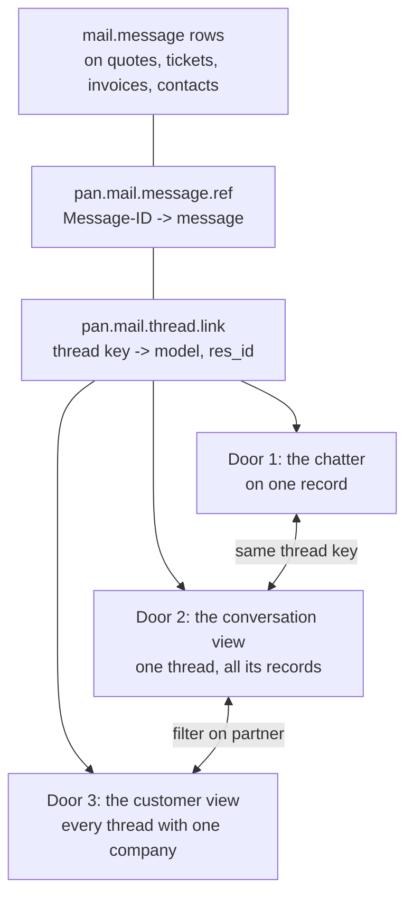

# The conversation view

Status: **agreed design**, 16 September 2026. Not built yet, so nothing here is
in `ARCHITECTURE.md`: that file describes what exists. When this ships, the
models and seams move there and this file becomes history.

Canvas: https://claude.ai/artifact/KsLjy3wNcx7q3dX34Gh3hB -- six artboards:
the inbox, an unfiled conversation, the model, the chatter with its door to the
mail, one customer's correspondence across records, and that customer's
timeline with the open activities on top.

The survey says two thirds of respondents already send from inside Odoo and
that what they cannot do is see a customer's correspondence in one place.
Odoo's chatter is record-centric; mail is conversation-centric. This is the
smallest object that closes that gap, in the layout people already know.

How it gets built -- the read API, the OWL components, and why this is not a
separate frontend -- is in
[conversation-view-build.md](conversation-view-build.md).

## The decision

**The conversation is a new object, and it is read in an inbox.**

A conversation groups `mail.message` rows that already exist. It does not copy
them, so every message keeps the access rights of the record it sits on and the
queue removed in 19.0.7.0.0 does not come back in another shape. Threading is
the `References` chain, with the provider's thread id as the fallback the
matcher already uses.

The screen is four panes:

1. **Folders.** The mailbox you are in, plus the states that are worth their own
   entry: needs reply, waiting on customer, sent, and the two unfiled ones (on a
   contact only, linked to nothing). Shared mailboxes below your own.
2. **The conversation list.** Sender, subject, snippet, date, and the record the
   thread is filed on. Unread is weight, not a badge.
3. **The thread.** Messages in order, quoted history collapsed, and a reply that
   goes out through the right mailbox with the conversation quoted underneath.
   That last part is a survey complaint in its own right: today each chatter
   reply reaches the customer as a standalone mail.
4. **The record.** The quote, ticket or invoice the thread is filed on, with its
   chatter. This is the pane a mail client cannot have, and the reason to read
   mail here rather than in Outlook. It is not, however, a pane nobody else
   has: see [the competition](../research/competition.md), where a paid module
   already advertises chatter sync with document links and a free one ships the
   same three-pane shape. What is ours is the discipline below, and the
   transport underneath.

When nothing is linked, the fourth pane shows what the matcher considered and
rejected, with a one-click way to file it. An unfiled conversation is the case
that decides whether people trust the screen, so it gets a designed state rather
than an empty panel.

An earlier draft put this on a tab of the contact form. It was rejected in
review for the right reason: nobody recognises that interface. The customer view
is still reachable, as the same list filtered to one company.

## What Odoo already has

[docs/research/odoo-mail-surfaces.md](../research/odoo-mail-surfaces.md) reads
Discuss, notifications and activities against the 19.0 source. In short: Odoo
has a notification queue you empty, a chat client, and a to-do list a person
fills in by hand. Nothing groups messages into a conversation, nothing shows a
customer's correspondence, and nothing knows that a customer is waiting for an
answer. Two consequences are load-bearing here: a follow-up with a date on it
is a `mail.activity` on the linked record, never a queue of our own, and this
app adds no systray counter next to the two Odoo already has.

## The interplay that does not work yet

Companies run Odoo and a mailbox side by side, and the two do not agree about
who is in a conversation. Odoo keeps followers, a list of people to notify
internally. Email keeps To and Cc, a list the customer can see. Odoo treats
them as one list, and both survey complaints follow from that:

- **"The automatic adding of followers creates complications."** `message_post`
  subscribes the recipients when `mail_post_autofollow` is in the context,
  subscribes the customer when the model asks for it, and subscribes the author
  besides. So being cc'd on one mail signs you up for everything that record
  ever does.
- **"Geen cc zichtbaarheid bij ontvanger, veroorzaakt veel verwarring."** The
  other direction: the customer cannot see who else is on the thread, because
  the people are followers rather than addressees.

**Position: the reply's recipients come from the conversation, the followers
stay the record's.** Who was on the last message decides the To and Cc; the
follower list decides who gets an internal notification; the reply header shows
both, separately, before you send. Nobody becomes a follower because they were
cc'd once.

This is not a fight with the framework. Odoo 19's `message_post` already takes
`outgoing_email_to` alongside `partner_ids`, described in its own docstring as
experimental, which is the same separation arriving from the other side.

## Why this is not a second source of truth

**The inbox is a rollup of the chatter, grouped by conversation key.** It holds
no fact of its own. Every action changes the record underneath, and the screen
re-reads it. That is the whole design, and it is what keeps Odoo, Discuss, the
Activities clock and the mailbox from disagreeing.

| What the inbox shows | Where it comes from | What the action writes |
|---|---|---|
| The messages | `mail.message`, on the record they were filed on | Nothing. The conversation is a grouping, not a copy |
| The grouping | `pan.mail.thread.link`, which this module already writes: the provider's thread handle or the References root, per mailbox, with `model`, `res_id` and `last_message_id` | Nothing new. It is already how the matcher finds a thread |
| Unread | `mail.notification` with `notification_type = 'inbox'` and `is_read`, the same rows Discuss reads | Marking read calls `set_message_done()`, which clears it in both screens |
| Flagged | `starred_partner_ids` | `toggle_message_starred()`, Discuss's own star |
| Waiting on us | Nowhere. Derived: the last message is inbound and nothing went back | Nothing. Recomputed every time, so it cannot drift |
| A reply | `mail.message`, through `message_post()` on the linked record | The chatter shows it, the followers get it, `mail.mail` sends it, the routing log records it |
| A follow-up with a date | `mail.activity` on the linked record | `activity_schedule()`, so it lands in the Activities clock |
| Where it is filed | `mail.message.model` and `res_id` | Re-filing writes those fields and a routing-log row saying a person overrode the matcher |
| Participants | The authors and recipients of the messages | Display only |

**No new model.** An earlier draft of this document proposed a
`pan.mail.conversation` table and then a private read pointer per person. Both
were unnecessary. The conversation already has a home in
`pan.mail.thread.link`, and read state already has one in `mail.notification`.
The two indexes this module keeps, `pan.mail.message.ref` and
`pan.mail.thread.link`, are derivations of the messages and can be rebuilt from
them, which is the test they have to pass in CI: drop them, rebuild, same
grouping and the same waiting-on-us answers.

**Unread on a shared mailbox is the one place that needs a decision.**
`needaction` is a notification row for your partner, so a message is only
unread for people who were notified about it, and nobody is notified about mail
in a shared mailbox they merely have access to. The answer is still to write
Odoo's row rather than one of our own: an inbox-type `mail.notification` for
the people who read that mailbox. It costs one thing and it should be said out
loud, because it is not free: those messages then also appear in their Discuss
Inbox. For `sales@` with three readers that is correct. For an `info@` that
takes two hundred mails a day it is a flood, so it is a setting on the mailbox
rather than a rule, and it is off until someone turns it on.

**The three fields we will be asked for and must refuse**: a per-user read flag
of our own, a per-conversation status (open, closed, resolved), and an assignee.
Every team-inbox product has them, each one is a fact the chatter cannot see,
and together they are how the screen stops agreeing with Odoo. Read state is
Odoo's needaction, status is derived, and the assignee of work is the activity's
`user_id` on the record.

## The two doors, and the customer view

The view is a visualisation layer, so its whole job is to put the same messages
in front of you from whichever side you arrive. Three surfaces, one set of rows:

None of the three stores anything. Each is a different `WHERE` over the rows
that already exist, and each reads them as the user, so a message on a record
somebody cannot open is simply not in their result.

### Door 1: from the chatter to the mail

The chatter shows the messages filed on **this** record. The conversation they
belong to may be larger, and that difference is exactly what surprises people
today.

- **On the record**, next to the chatter's own controls, one button:
  **Open in mail**. It opens the conversation view on this record's newest
  thread. Always present on a record that has any emailed message, so it is a
  place rather than a surprise.
- **On a message**, a line appears *only* when the conversation holds messages
  that are not on this record: "Part of a conversation with Acme BV, 3 more
  messages elsewhere." That is the case worth an interruption. When everything
  is already on the chatter, the line would be noise and is not drawn.

### Door 2: from the mail to the chatter

The fourth pane is the record and its chatter, live, not a summary: the same
form Odoo renders, with its own buttons. Two things make it a door rather than
a preview.

- **A breadcrumb** that opens the record full screen, which is where you go to
  actually change something.
- **A record chip per record the conversation touched.** A thread that started
  as a quote and continued on a ticket shows both, newest first, and clicking
  one swaps the pane. Which answers the open question this document used to
  carry: **a conversation may span records.** The thread is the conversation,
  the filing is per message, and the pane follows the message you have
  selected. Splitting it into two conversations would hide exactly the history
  people open this screen to find.

### Door 3: the customer view

Every thread where one company is a participant, across records and across
mailboxes, in the same three panes with the folder column replaced by the
company. It is the inbox with one filter on it, not a second screen.

**Two tabs, not five.** *Conversations* is the default, because mail is why the
screen exists. *Timeline* is the 360: one axis, newest first, carrying the
messages, the activities that were done and the record events a person would
mention out loud, with three filter chips over it. Pinned above that axis,
**Next**: the open activities with their deadline and their owner, because a
history answers what happened and never answers what now. Those are
`mail.activity` rows, unchanged, marked done through `activity_schedule()`'s own
counterpart so the Activities clock agrees.

Where each of those came from, and the four things it refuses (a health score,
an AI summary of the relationship, bought enrichment, and a stored
last-contacted field), is in
[docs/research/customer-360.md](../research/customer-360.md).

Reached from the contact form, from a button in the button box with the
conversation count on it, so the path is the one Odoo users already know:
open the customer, see their correspondence. Also reachable from any
conversation, by clicking the company name.

The company, not the person. A conversation with `jan@acme.com` and
`inkoop@acme.com` is one company's correspondence, and the partner's
`commercial_partner_id` is how Odoo already says that.

### What none of the doors do

- **They do not talk to the provider.** Every pane is a query on Odoo. The sync
  is the only thing that touches Graph, Gmail or IMAP, on its own schedule.
- **They do not widen access.** The messages a door shows are the ones the user
  could already read on the record. There is no sudo anywhere in this layer,
  which is also why there is no "conversations I cannot see" counter.
- **They do not write a link.** The thread key is what the matcher already
  stored when the mail arrived. A door that had to create a link would be a
  second filing decision, and the routing log exists so there is only one.

## What it reuses

- `pan_mail_matcher` decides which record a message belongs to. Unchanged.
- `pan_mail_routing_log` already records why it landed there and what was
  rejected. The fourth pane shows it rather than re-deriving it.
- Odoo's own message rights do the filtering. Read `mail.message` as the user,
  never as sudo: a message on a record they cannot open simply is not there.

## What we are not building, and why

- **Folders, labels, rules, snooze.** The provider has them. A second set that
  disagrees with the first is worse than none.
- **Read state synced back to the provider.** Expensive, fragile, and it drifts
  the moment a sync is late. "Waiting on us" is derived from the messages
  instead, so it cannot be wrong.
- **Team-inbox machinery**: assignment, SLA timers, collision detection, a chat
  per thread. That is Missive and Chatwoot, and three of the 28 respondents have
  already bought one. The chatter already holds the internal conversation, one
  pane to the right.

An inbox does earn the app tile that 19.0.7.0.0 took away, by that release's own
test: a tile is a promise about how often a screen is opened, and this one is
opened all day. The diagnostics it removed stay where they are.

## Open questions

- Whether "waiting on us" should also be personal on a shared mailbox, or stay
  one list for the team. The read pointer makes unread personal; waiting-on-us
  is derived from the messages and is therefore the same for everyone, which is
  probably right for a team of three and probably wrong for a team of ten.
