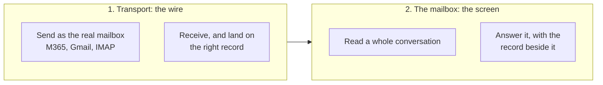
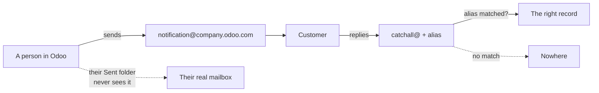
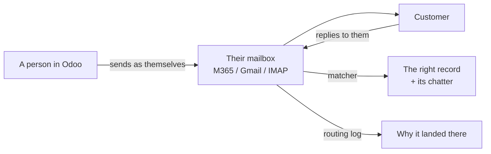
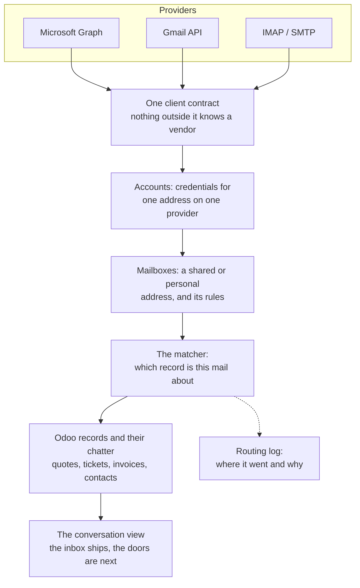

# Mail Pro: the problem, and whose problem it is

High over. No models, no field names. This is the page you hand someone who
asks what we are building and why. The design of what exists is in
[ARCHITECTURE.md](../ARCHITECTURE.md), the design of what is next is in
[docs/plans/conversation-view.md](plans/conversation-view.md), and the evidence
under both is in [docs/research/](research/).

Written 17 September 2026, after 28 replies to the customer survey and a read
of the Odoo Apps Store.

## In one paragraph

A company runs its business in Odoo and its correspondence in Outlook or Gmail.
The two do not know about each other. Mail Pro makes the mailbox and the ERP one
system: mail goes out as the person who sent it, mail comes back onto the record
it belongs to, and the whole conversation with a customer can be read in one
screen with the quote or the ticket next to it.

## The problem is two problems

The Odoo Apps Store treats email in Odoo as one product. It is two, and a
supplier can solve either without the other. Almost all of them do.



**Transport is what breaks first.** Odoo's own path runs on a catchall address
and per-record aliases. Five of the 28 respondents named setup as the wall, in
the words of one of them "very difficult for a non-IT specialist". Three said
their mail arrives from `notification@` instead of from a person, and that
replying to it fails.

**The mailbox is what makes people leave.** Three said their mail is scattered,
with no central place in Odoo and nothing sent from Odoo ever appearing in
Outlook. Four said there is no CC and the customer cannot see who is on the
thread. Three said every chatter reply reaches the customer as a standalone mail
with no conversation above it.

Split by whether we answer it today: 11 people named something Mail Pro already
fixes, 9 named something it does not, 3 are in both columns, and nobody named a
problem outside those two columns. The plumbing was built first; the screen
followed in 19.0.10.0.0.

## What the detour costs

Today, mail leaves and arrives through an address nobody reads:



With Mail Pro the person's own mailbox is the wire, in both directions:



Two things follow that no alias setup gives you. The customer answers a person,
not a robot. And the Sent folder of that person contains the mail, so the half
of the company that lives in Outlook still sees the thread.

## Who this is for

**The buyer.** A company of roughly 5 to 50 people that has decided Odoo is
where the work lives, on Microsoft 365 or Google Workspace, where a handful of
people write to customers all day: sales answering a quote, support answering a
ticket, someone chasing an invoice. The person who buys it is usually the one
who tried to configure the catchall.

**The user.** Whoever answers customers. They do not care about ERPs. They care
that the thread is whole, that the reply comes from them, and that the quote is
on the screen while they type.

**The channel.** Odoo partners. Three of the 28 respondents are partners, and
two of those had already paid a developer to patch CC and follower behaviour by
hand. A partner who resells this stops writing that patch per customer.

### Who this is not for

Naming these is the point of the section. Each one is a real request we refuse.

| Not our user | Why |
|---|---|
| Companies that decided Odoo is a back office and Outlook is the front | Odoo's own free Mail Plugin serves them from inside Outlook. 8 of 28 respondents live here, and we are not going to win them with a screen inside the ERP |
| Teams that want a helpdesk: assignment, SLA timers, collision detection | That is Missive, Front and Chatwoot, and two Odoo store modules. The chatter already holds the internal conversation |
| Marketing and mass mailing | Odoo's own Email Marketing app, and Brevo underneath it if the volume is real |
| One admin who only sends invoices | Odoo out of the box is fine. Nothing here is worth a seat for that person |

## What we sell them

Three sentences, in the order they matter.

1. **Setup that finishes.** One app registration, one consent screen, one
   mailbox. No catchall, no bounce alias, no DNS argument.
2. **Mail that is from a person and lands on a record.** With a log that says
   where each incoming message went and why, so a mail that landed wrong is a
   question with an answer rather than a mystery.
3. **The conversation, with the record beside it.** One screen, in the shape of
   an inbox, where the fourth pane is the quote or the ticket. That is the pane
   Outlook can never have, and it is the reason to read mail here.

The first two exist, and so does the third as of 19.0.10.0.0: the inbox ships
with the record beside the thread. What is still on paper is the chatter's own
door into it and the per-customer timeline.

## The shape of the thing



The rule that holds it together: nothing above the client contract knows which
vendor it is talking to, and nothing below it knows what an Odoo record is. That
is why a third provider was an afternoon and not a rewrite.

The screen, in the layout people already know:

```
┌──────────┬─────────────────────┬──────────────────────┬─────────────────────┐
│ Folders  │ Conversations       │ The thread           │ The record          │
│          │                     │                      │                     │
│ Inbox    │ Acme BV        2d   │ Re: quote SO0042     │ SO0042  Acme BV     │
│ Needs    │ Re: quote SO0042    │                      │ €12,400  Sent       │
│  reply   │ "can you split..."  │ ── Jan, Tuesday ──   │                     │
│ Waiting  │ Bakker & Zn    4d   │ Can you split the    │ Chatter             │
│ Unfiled  │ Invoice question    │ delivery over two    │ · quote sent  2d    │
│          │                     │ weeks?               │ · note: check stock │
│          │                     │                      │                     │
│ sales@   │ Hendriks       1w   │ ── You, Tuesday ──   │ [Activity: call Jan]│
│ support@ │ Ticket #318         │ Yes, I will...       │                     │
└──────────┴─────────────────────┴──────────────────────┴─────────────────────┘
```

The fourth pane is the product. The first three are table stakes that have to be
as good as Outlook every day, because on the day they are not, the user has
Outlook already open.

## What we deliberately do not build

- **A second copy of the mail.** The conversation view groups messages that
  already exist on records. Nothing is copied, so every message keeps the access
  rights of the record it sits on.
- **Folders, labels, rules, snooze.** The provider has them. A second set that
  disagrees with the first is worse than none.
- **Read state pushed back to the provider.** Expensive, fragile, wrong the
  moment a sync is late.
- **Team-inbox machinery.** Assignment, SLA, collision detection. See the table
  above.
- **AI triage.** Built once, removed in 19.0.7.0.0 with the queue it served. It
  comes back when a customer asks for it by name, not before.

## How it is paid for

Per seat, priced against Missive rather than against the Odoo store. The store
is a shop window: the download counts in that category are 1, 66 and 137, and
Odoo keeps 30% of a one-off sale. The people who actually have this problem pay
Missive around $1,440 a year for a team of five, to a vendor that knows nothing
about their quotes. The reasoning, and the numbers under it, are in
[docs/research/competition.md](research/competition.md).

Consulting is the third leg and the one that does not scale, but it is the
shortest path to the first revenue.

## What would prove this wrong

Four bets, stated so they can be checked rather than argued, live in
[competition.md](research/competition.md). The cheapest to test, and the one
nobody has tested, is the first: that the record beside the thread is worth
switching for. If it is not, this is a worse Outlook and the free module in the
store is the ceiling.

The one to watch every release is the fourth. Odoo 19 already ships per-user
Gmail and Outlook connection and stopped adding customers as followers, which
is the survey's most-named complaint fixed in core. The gap is real today and it
is not standing still.

## Where the detail is

| Question | File |
|---|---|
| How does what exists work | [ARCHITECTURE.md](../ARCHITECTURE.md) |
| What does the inbox look like, exactly | [docs/plans/conversation-view.md](plans/conversation-view.md) |
| What did customers actually say | [docs/research/email-in-odoo-survey-2026-09.md](research/email-in-odoo-survey-2026-09.md) |
| Who else sells this, and for what | [docs/research/competition.md](research/competition.md) |
| What does Odoo already have | [docs/research/odoo-mail-surfaces.md](research/odoo-mail-surfaces.md) |
